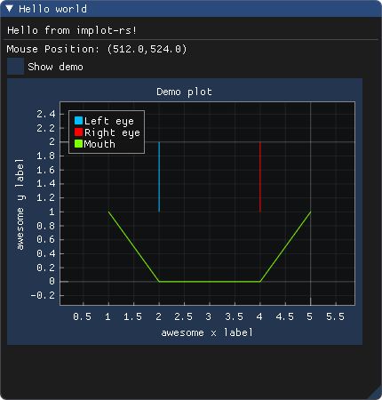

# implot-rs

Rust bindings for [ImPlot](https://github.com/epezent/implot), built by running
[bindgen](https://github.com/rust-lang/rust-bindgen) on [cimplot](https://github.com/cimgui/cimplot).
Currently not released on crates.io yet due to a dependency on an unreleased version of `imgui-rs`.
One can still use it as a dependency directly from Git if desired, for example using the line
```
implot = { git = "https://github.com/4bb4/implot-rs/", rev = "your_favourite_commit" }
```
This is a work in progress. See the "Status" section below for notes on what is already built.



## Requirements
imgui-rs requires minimum Rust version 1.40, so this project does as well by extension.
Currently a pinned version (66260c123b9a80275bd3a366ef403444db11a676) of imgui-rs is used 
as a dependency until https://github.com/Gekkio/imgui-rs/pull/339 makes it into a release.

The sys crate compiles implot, so a C++ compiler will also be required.

## Examples 
Examples are being built in the `implot-examples` crate in this repo. To try them out, 
clone the repo, change into the `implot-examples` directory and try for example
```
  cargo run --example line_plots
```

## Documentation
Since the crate is not released yet, the documentation is not hosted yet either. You
can build it yourself however by cloning this repo and then doing 
```
  cargo doc --open
```
An effort is made to document everything as it is being added. Feel free to open an issue
if documentation is unclear or lacking.

## Design approach
This repo tries to follow the approaches and style used in `imgui-rs` somewhat closely,
because implot is to be used within imgui programs, and hence keeping the interfaces
and design philosophies close should make it easier to do that.

If you spot any design inconsistencies or paper cuts, feel free to open an issue.

## Status
Currently a work in progress. The author is open to collaboration, if you'd like to 
help, feel free to reach out via a Github issue.

Note that the API is not stabilized yet and expected to change as development progresses.
Once there are actual releases on crates.io, semantic versioning will be followed.

At this point, raw bindings are working in implot-sys, and more idiomatic interfaces
for plot creation as well a subset of the functionality for plots are implemented. 
The master branch points to roughly implot 0.3, and a checklist of what is already
implemented is shown below. Work is ongoing to move to implot 0.7 in the branch
named `update-to-cimplot-0.7`. The latter branch is buildable, but work on wrapping
the newly explicit contexts is not done yet, which is why it has not been merged into 
master yet.

- [x] "BeginPlot"
  - [x] Basic hello world
  - [x] Plot flags
- [ ] Plotting functionality
  - [x] Line plot
  - [x] Text plot
  - [x] Scatter plot
  - [x] Bar plot
    - [x] Vertical
    - [x] Horizontal
  - [ ] Error bar plot
    - [ ] Vertical
    - [ ] Horizontal
  - [ ] Heatmap
  - [ ] Pie chart
  - [ ] Digital data
- [x] Plot customization
  - [x] Axis flags
  - [x] Styling colors
  - [x] Styling variables
  - [x] Colormaps
- [ ] Plot querying 
  - [x] is hovered
  - [x] mouse position in plot
  - [x] plot limits
  - [x] is queried
  - [x] get plot query
  - [ ] Choice of y axis
- [ ] Utils
  - [x] Plot limit setting
  - [x] imgui-rs style safe push/pop stacks
  - [x] Plot tick setting
  - [ ] Set Y axis setting for subsequent elements
  - [ ] Plot position and size reading
  - [ ] Pixel to plot position
  - [ ] Plot to pixel position
  - [ ] Push/pop plotclip rect (?)
